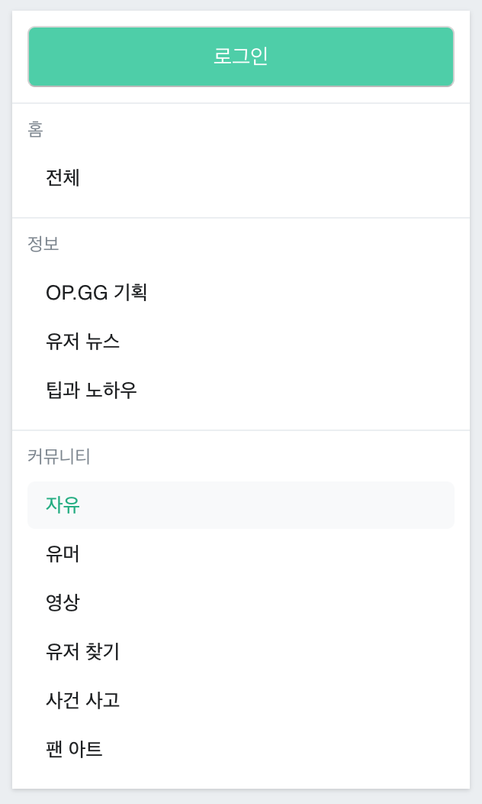

# OP.GG 게시판 기능을 React로 Copy 해보는 실습

## 1주차

* 게시판 왼쪽 메뉴 리스트 만들기
  
  1. 컴포넌트 나눠보기
  2. 컴포넌트 속성 생각해보기
  3. 작은 컴포넌트부터 만들어보기
  
* 컴포넌트에 스타일링 하기

  1. 큰 컴포넌트부터 리스팅하기(scss 구조 작성하기)
  2. 큰 컴포넌트부터 스타일링 하기

### 결과

